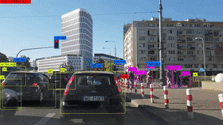

# Browser based Web Detection

## introduction
This project uses Tensorflow.js pretrained machine learning model which is trained on the ``` COCOSSD ``` database to successfully detect and name objects using the webcamera.



## Direction for use:-

- ```git clone https://github.com/Parth442002/web_object_detection.git```
- ``` npm install```
- ```npm run dev```


## Live Preview
- ### [WebDection](https://web-object-detection-jzogc5sdv-parth442002.vercel.app)
